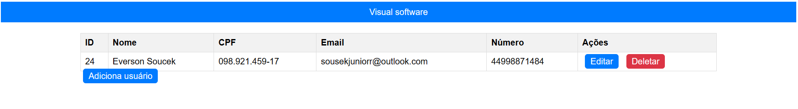

# Back-end Processo Seletivo Visual Software

    
    
    

Este é o back-end do projeto, implementando um CRUD com PHP em conexão com um banco de dados MySQL.

## :hammer: Funcionalidade do projeto

Um sistema que oferece as funcionalidades de adicionar, editar e deletar usuários, interagindo diretamente com um banco de dados MySQL.

## :wrench: Técnicas e tecnologias utilizadas

- 🐘 `PHP`

## :file_folder: Acesso ao projeto

Primeira opção:
Você pode acessar o projeto e baixá-lo pelo [GitHub](https://github.com/EversonSoucek/ProcessoVisual-PHP).

## :computer: Rodar o projeto

Para rodar o projeto localmente, é necessário ter um servidor PHP e MySQL configurado (XAMPP, WAMP, Docker ou qualquer outro ambiente que suporte PHP e MySQL).

Configure seu servidor para apontar para a pasta do projeto clonado.
Acesse http://localhost/ em seu navegador para ver o projeto em funcionamento.

## :pencil: Autores

 Everson Adolfo Soucek Junior(https://github.com/EversonSoucek)